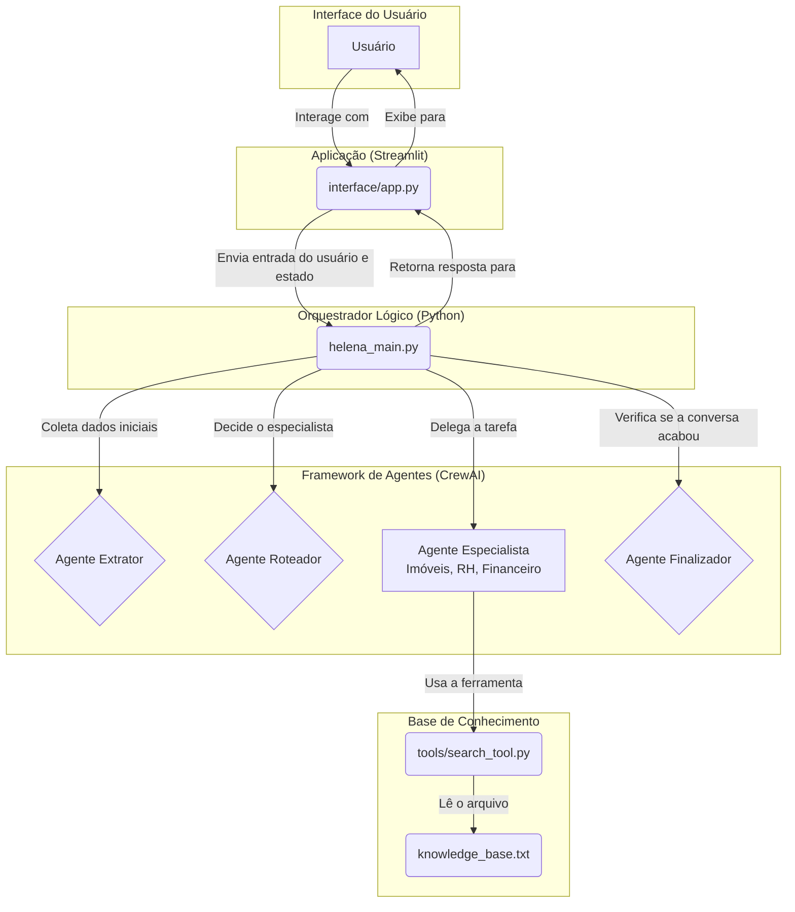

# ImobIA - Assistente Virtual da Cardoso Imóveis

ImobIA é um assistente virtual inteligente projetado para o atendimento ao cliente da imobiliária Cardoso Imóveis. Construído com Python, Streamlit e o framework de agentes CrewAI, ele é capaz de entender, rotear e responder a uma variedade de solicitações de clientes, desde informações sobre imóveis até questões de RH e financeiras.

## Visão Geral da Arquitetura

O sistema é projetado em uma arquitetura modular que separa a interface, a lógica de negócios e a base de conhecimento. A interação flui desde a interface do usuário no Streamlit, passa por um orquestrador central (`helena_main.py`) que gerencia o estado da conversa, e utiliza uma equipe de agentes de IA (CrewAI) para realizar tarefas específicas.



## Recursos Principais

- **Interface Conversacional:** Interface de chat amigável construída com Streamlit.
- **Gerenciamento de Estado:** A conversa mantém o contexto (nome do usuário, cidade, assunto).
- **Extração de Dados com IA:** Um agente especializado extrai informações estruturadas (nome, cidade) da conversa.
- **Roteamento Inteligente:** Um agente roteador analisa o assunto e encaminha a conversa para o especialista correto (Imóveis, RH, Financeiro).
- **Busca em Base de Conhecimento:** Os agentes especialistas usam uma ferramenta para buscar informações em um arquivo de texto (`knowledge_base.txt`), garantindo respostas baseadas em fatos.
- **Finalização de Conversa:** Um agente dedicado detecta quando o usuário deseja encerrar o atendimento.
- **Pronto para Deploy:** Inclui configuração para `Docker` e `docker-compose`, facilitando a implantação em produção.

## Estrutura do Projeto

```
.
├── agents/
│   └── agentes_mcp.py      # Definições dos agentes especialistas (sem a lógica principal)
├── interface/
│   └── app.py              # Código da interface de usuário com Streamlit
├── tools/
│   └── search_tool.py      # Ferramenta de busca na base de conhecimento para os agentes
├── .gitignore              # Arquivos a serem ignorados pelo Git
├── .dockerignore           # Arquivos a serem ignorados pelo Docker
├── Dockerfile              # Receita para construir a imagem Docker da aplicação
├── docker-compose.yml      # Arquivo de orquestração para rodar o container
├── helena_main.py          # Coração da aplicação, orquestra os agentes e o fluxo
├── knowledge_base.txt      # Base de dados em texto simples com as informações da empresa
├── pyproject.toml          # Arquivo de dependências e configuração do projeto (para 'uv')
├── requirements.txt        # Lista de dependências (para Docker/outros ambientes)
└── README.md               # Este arquivo
```

## Como Executar Localmente

### Pré-requisitos
- Python 3.9+
- `uv` (instalador de pacotes, recomendado: `pip install uv`)

### 1. Clonar o Repositório
```bash
git clone https://github.com/raphaelrsantos/ImobIA.git
cd ImobIA
```

### 2. Configurar o Ambiente Virtual e Dependências
```bash
# Criar o ambiente virtual
python -m venv .venv

# Ativar o ambiente (Windows)
.venv\Scripts\activate

# Instalar as dependências com uv
uv pip sync
```

### 3. Configurar Variáveis de Ambiente
Crie um arquivo chamado `.env` na raiz do projeto e adicione sua chave da API da OpenAI:
```env
OPENAI_API_KEY="sk-..."
```

### 4. Rodar a Aplicação
```bash
streamlit run interface/app.py
```
Acesse `http://localhost:8501` em seu navegador.

## Como Implantar com Docker e Portainer

A aplicação está pronta para ser implantada como um container Docker, ideal para ambientes de produção como um VPS.

### 1. Pré-requisitos no Servidor
- Docker instalado.
- Portainer instalado (recomendado).

### 2. Implantação via Portainer (usando Git)
1.  No seu servidor, acesse a interface do Portainer.
2.  Vá para **Stacks** > **Add stack**.
3.  Dê um nome à sua stack (ex: `imobia-app`).
4.  Selecione **Git Repository** como o método de build.
5.  **Repository URL:** `https://github.com/raphaelrsantos/ImobIA.git`
6.  **Compose path:** Deixe o padrão `docker-compose.yml`.
7.  Na seção **Environment variables**, clique em **Add environment variable** e adicione sua chave da OpenAI de forma segura:
    - **Name:** `OPENAI_API_KEY`
    - **Value:** `sk-sua-chave-secreta`
8.  Clique em **Deploy the stack**.

O Portainer irá clonar o repositório, construir a imagem Docker e iniciar o serviço. Sua aplicação estará acessível em `http://<IP_DO_SEU_SERVIDOR>:8501`.
